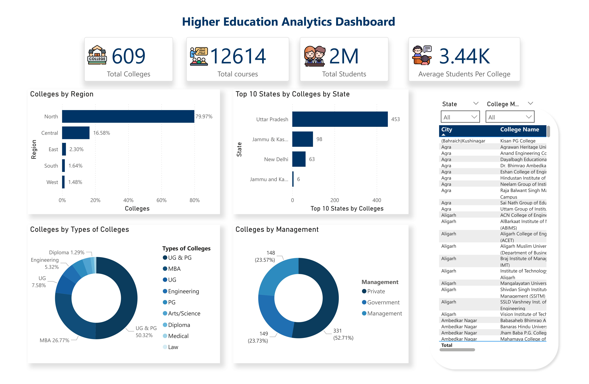
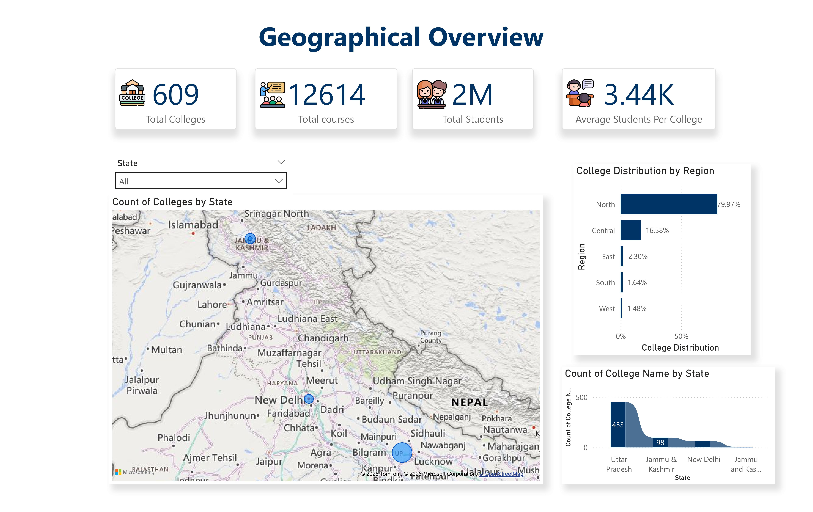
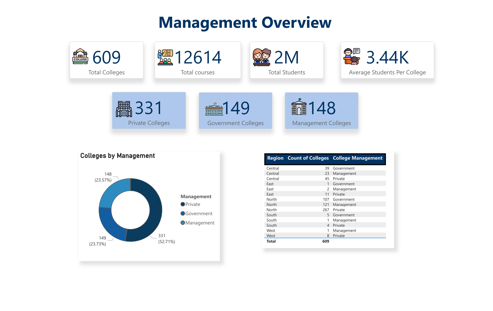
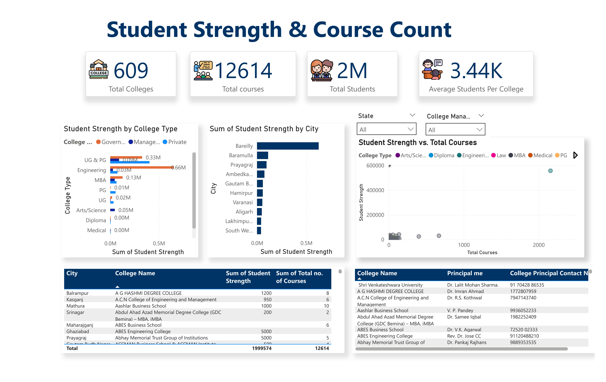

# Higher-Education-Aanalytics__Powerbi
Interactive Power BI dashboard analyzing 600+ colleges, 12K+ courses, and 2M+ students to identify regional, management, and capacity insights
## Dashboard Preview

### Main Dashboard

### Geographical Overview

### Management Overview

### Student Strength & Course Analysis

